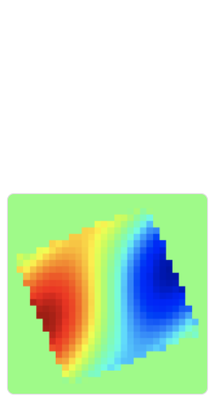

#   FCC-ee Impedance/Wake Model 

*A repository containing all elements of the FCC-ee impedance wake model.*

---

## 🌀 Overview

This repository contains the **Impedance/Wake Model** for the FCC-ee project.  
Here, you will find all the necessary elements, scripts, and data to work with the model.

---

## 🚀 Getting Started

To get the repository:

```bash
git clone https://github.com/ImpedanCEI/fcc_ee_IW_model
```

Once cloned, navigate into the repository folder:

```bash
cd fcc_ee_IW_model
```

---

## 📁 Contents


- **Elements** – All impedance wake model elements are collected here:
  - **BPMs** – 10,000 evaluated with CST.
  - **RF_cavities** – 132 single-cell 400 MHz RF cavities.
  - **bellows** – Bellows section models.
  - **collimators** – 41 collimators; Geometrical (CST) and RW (IW2D) contributions considered.
  - **pipe** – Circular copper cross-section (radius 30 mm) coated with a 150 nm NEG layer; evaluated with IW2D + numerical form factor for both driving and detuning impedance/wake, considering the realistic vacuum chamber shape.
  - **tapers** – 33 taper elements.
- **Scripts** – Utilities for running and analyzing simulations.
- **images** – Contribution plots.
- **Output** – Output files for your workflow.

```
fcc_ee_IW_model/
├─ elements/
│  ├─ BPMs/ — 10,000 evaluated with CST
│  ├─ RF_cavities/ — 132 single-cell 400 MHz RF cavities
│  ├─ bellows/
│  ├─ collimators/ — 41 collimators. Geometrical (CST) and RW (IW2D) contributions are considered.
│  ├─ pipe/ — Circular copper cross-section (radius 30 mm) coated with a thin 150 nm NEG layer.
│      Evaluated with IW2D + numerical form factor for both driving and detuning impedance/wake,
│      considering the realistic shape of the vacuum chamber.
│  └─ tapers/ — 33
├─ script/
├─ images/
├─ output/
└─ README.md
```


